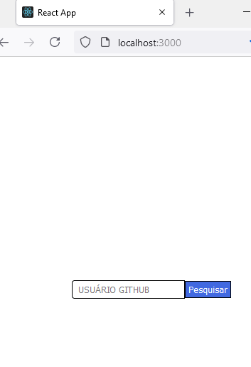
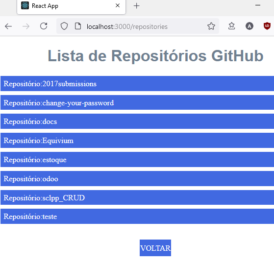

    

    <

 ## 🚀 Tecnologias

- JavaScript
- HTML
- REACT (Biblioteca)

## 💻 Projeto

Listar repositórios de usuários do GitHub, foi desenvolvido em JavaScript + React + HTML , foi apresentado e projetado pelo professor Guilherme Ramos no "Curso de React" na plataforma da Gama Academy, durante o treinamento fullstack do Hiring Coders - VTEX 2021.

Neste projeto, a aplicação coleta o nome do usuário cadastrado na plataforma do Git Hub e logo após, mostra os nomes dos repositórios existentes publicados do usuário.

 
## 📝 Aprendizado - Anderson Nascimento

 Foi meu primeiro contato com a biblioteca REACT e relembrar alguns conceitos em JavaScript , muito boa a experiência. 😀

 ## 📝 Como Executar ??

01) Baixar e instalar <a href="https://nodejs.org/en/download/"> Node.js Lts</a> 

02) Abrir o Terminal/PowerShell em Modo Administrador, dentro do diretório baixado, e executar o comando:

* npm install --save react-native-cli

Leva +- 3min para concluir.....

03) Ao terminar de reinstalar o react no diretório, execute o comando para iniciar:

* npm start

Irá leva alguns segundos e automaticamente a aplicação iniciará em seu Browser em:
 
 http://localhost:3000/

Agora pode testar! 😀

